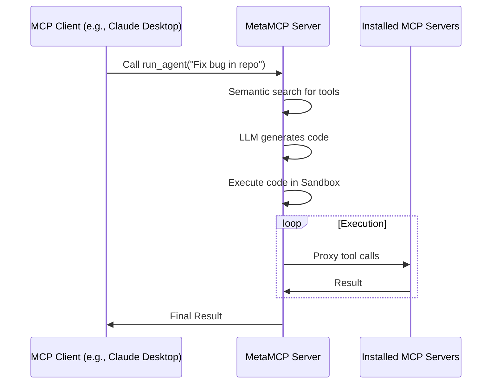

# 🚀 MetaMCP (MCP Aggregator, Orchestrator, Middleware, Gateway in one docker) <!-- omit in toc -->

<div align="center">

<div align="center">
  <a href="https://discord.gg/mNsyat7mFX" style="text-decoration: none;">
    
  </a>
  <a href="https://docs.metamcp.com" style="text-decoration: none;">
    
  </a>
  <a href="https://opensource.org/licenses/MIT" style="text-decoration: none;">
    
  </a>
  <a href="https://github.com/metatool-ai/metamcp/pkgs/container/metamcp" style="text-decoration: none;">
    
  </a>
  <a href="https://deepwiki.com/metatool-ai/metamcp"></a>
</div>

</div>

> **📢 Update:** *[From the author: apologize for some recent maintainence delay, but will at least keep merging PRs, more background [here](recent-updates.md)]*

**MetaMCP** is a MCP proxy that lets you dynamically aggregate MCP servers into a unified MCP server, and apply middlewares. MetaMCP itself is a MCP server so it can be easily plugged into **ANY** MCP clients.

**New Features**:
- **Progressive Tool Disclosure**: Expose only meta-tools (`search_tools`, `load_tool`, `run_code`) to minimize context usage.
- **Semantic Tool Search**: "Tool RAG" using embeddings and `pgvector` to find relevant tools.
- **Code Mode & Autonomous Agents**: Securely execute TypeScript/JavaScript code in a sandbox. Use `run_agent` for autonomous task execution (text-to-code).
- **Traffic Inspection**: Persistent logging of tool calls, arguments, and results ("Mcpshark").
- **Saved Scripts & Tool Sets**: Persist useful scripts and tool profiles.
- **Config Import**: Easily import existing `claude_desktop_config.json` files.


---

For more details, consider visiting our documentation site: https://docs.metamcp.com

English | [中文](./README_cn.md)
## 📋 Table of Contents <!-- omit in toc -->

- [🎯 Use Cases](#-use-cases)
- [📖 Concepts](#-concepts)
  - [🖥️ **MCP Server**](#️-mcp-server)
  - [🏷️ **MetaMCP Namespace**](#️-metamcp-namespace)
  - [🌐 **MetaMCP Endpoint**](#-metamcp-endpoint)
  - [⚙️ **Middleware**](#️-middleware)
  - [🔍 **Inspector (Mcpshark)**](#-inspector-mcpshark)
  - [✏️ **Tool Overrides \& Annotations**](#️-tool-overrides--annotations)
  - [⚡ **Code Mode & Tool Chaining**](#-code-mode--tool-chaining)
  - [🤖 **Autonomous Agents**](#-autonomous-agents)
  - [📂 **Saved Scripts & Tool Sets**](#-saved-scripts--tool-sets)
- [🚀 Quick Start](#-quick-start)
  - [🐳 Run with Docker Compose (Recommended)](#-run-with-docker-compose-recommended)
  - [📦 Build development environment with Dev Containers (VSCode/Cursor)](#-build-development-environment-with-dev-containers-vscodecursor)
  - [💻 Local Development](#-local-development)
  - [🔧 Running Without Docker](#-running-without-docker)
- [🔌 MCP Protocol Compatibility](#-mcp-protocol-compatibility)
- [🔗 Connect to MetaMCP](#-connect-to-metamcp)
- [🔐 Authentication](#-authentication)
- [🏗️ Architecture](#️-architecture)
- [🤝 Contributing](#-contributing)

## 🎯 Use Cases
- 🏷️ **Group MCP servers into namespaces, host them as meta-MCPs, and assign public endpoints** (SSE or Streamable HTTP), with auth. One-click to switch a namespace for an endpoint.
- 🎯 **Pick tools you only need when remixing MCP servers.** Apply other **pluggable middleware** around observability, security, etc. (coming soon)
- 🔍 **Use as enhanced MCP inspector** with saved server configs, and inspect your MetaMCP endpoints in house to see if it works or not.
- 🔍 **Use as Elasticsearch for MCP tool selection** (Semantic Search / Tool RAG).
- ⚡ **Use Code Mode** to allow agents to write scripts that chain multiple tools together, reducing round-trips and token costs.
- 🤖 **Run Autonomous Agents** to solve complex tasks by self-generating code and discovering tools.

## 📖 Concepts

### 🖥️ **MCP Server**
A MCP server configuration that tells MetaMCP how to start a MCP server.

```json
"HackerNews": {
  "type": "STDIO",
  "command": "uvx",
  "args": ["mcp-hn"]
}
```

### ⚡ **Code Mode & Tool Chaining**
- **MetaMCP Hub** exposes a `run_code` tool that accepts TypeScript/JavaScript.
- The code runs in a secure sandbox (`isolated-vm`).
- Scripts can call other available MCP tools using `await mcp.call('tool_name', args)`.
- **Recursive Routing**: Tool calls from inside the sandbox flow back through the MetaMCP middleware stack, ensuring logging, authentication, and policy enforcement apply to every sub-call.

### 🤖 **Autonomous Agents**
- **MetaMCP Hub** exposes a `run_agent` tool.
- Pass a natural language task description (e.g., "Find the latest issue in repo X and summarize it").
- The agent will:
    1. Semantically search for relevant tools.
    2. Write a script to solve the problem.
    3. Execute the script in the sandbox.
- This effectively turns any MCP client into a coding agent.

## 🚀 Quick Start

### **🐳 Run with Docker Compose (Recommended)**

Clone repo, prepare `.env`, and start with docker compose:

```bash
git clone https://github.com/metatool-ai/metamcp.git
cd metamcp
cp example.env .env
# Edit .env to add OPENAI_API_KEY if you want semantic search features
docker compose up -d
```

### **💻 Local Development**

Still recommend running postgres through docker for easy setup:

```bash
pnpm install
pnpm dev
```

### **🔧 Running Without Docker**

If you prefer to run MetaMCP directly on your machine (e.g., if you already have Postgres running), you can use the setup script:

```bash
./scripts/setup-local.sh
pnpm dev
```

Ensure your `.env` file points to your local Postgres instance (`DATABASE_URL`).

## 🏗️ Architecture

- **Frontend**: Next.js
- **Backend**: Express.js with tRPC, hosting MCPs through TS SDK and internal proxy
- **Auth**: Better Auth
- **Structure**: Standalone monorepo with Turborepo and Docker publishing

### 📊 Sequence Diagram



## 🤝 Contributing

We welcome contributions! See details at **[CONTRIBUTING.md](CONTRIBUTING.md)**

## 📄 License

**MIT**
