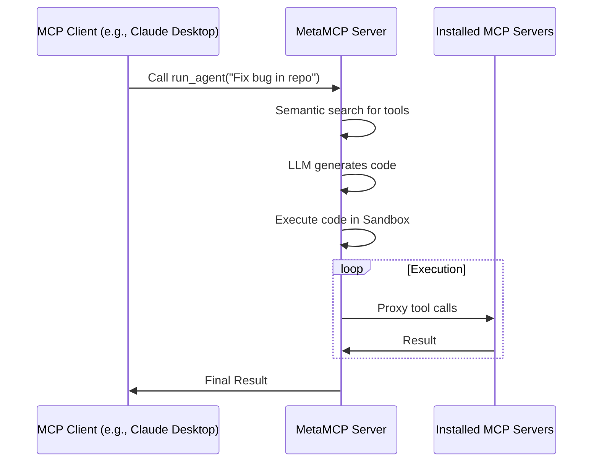

# 🚀 MetaMCP (MCP Aggregator, Orchestrator, Middleware, Gateway in one docker) <!-- omit in toc -->

<div align="center">

<div align="center">
  <a href="https://discord.gg/mNsyat7mFX" style="text-decoration: none;">
    
  </a>
  <a href="https://docs.metamcp.com" style="text-decoration: none;">
    
  </a>
  <a href="https://opensource.org/licenses/MIT" style="text-decoration: none;">
    
  </a>
  <a href="https://github.com/metatool-ai/metamcp/pkgs/container/metamcp" style="text-decoration: none;">
    
  </a>
  <a href="https://deepwiki.com/metatool-ai/metamcp"></a>
</div>

</div>

> **📢 Update:** *[From the author: apologize for some recent maintainence delay, but will at least keep merging PRs, more background [here](recent-updates.md)]*

**MetaMCP** is a MCP proxy that lets you dynamically aggregate MCP servers into a unified MCP server, and apply middlewares. MetaMCP itself is a MCP server so it can be easily plugged into **ANY** MCP clients.

**New Features**:
- **Progressive Tool Disclosure**: Expose only meta-tools (`search_tools`, `load_tool`, `run_code`) to minimize context usage.
- **Semantic Tool Search**: "Tool RAG" using embeddings and `pgvector` to find relevant tools.
- **Code Mode & Autonomous Agents**: Securely execute TypeScript/JavaScript code in a sandbox. Use `run_agent` for autonomous task execution (text-to-code).
- **Traffic Inspection**: Persistent logging of tool calls, arguments, and results ("Mcpshark").
- **Saved Scripts & Tool Sets**: Persist useful scripts and tool profiles.
- **Config Import**: Easily import existing `claude_desktop_config.json` files.


---

For more details, consider visiting our documentation site: https://docs.metamcp.com

English | [中文](./README_cn.md)
<<<<<<< HEAD
## 📋 Table of Contents <!-- omit in toc -->
=======

## 📋 Table of Contents
>>>>>>> origin/2.3-no-cors

- [🎯 Use Cases](#-use-cases)
- [📖 Concepts](#-concepts)
  - [🖥️ **MCP Server**](#️-mcp-server)
  - [🏷️ **MetaMCP Namespace**](#️-metamcp-namespace)
  - [🌐 **MetaMCP Endpoint**](#-metamcp-endpoint)
  - [⚙️ **Middleware**](#️-middleware)
  - [🔍 **Inspector (Mcpshark)**](#-inspector-mcpshark)
  - [✏️ **Tool Overrides \& Annotations**](#️-tool-overrides--annotations)
  - [⚡ **Code Mode & Tool Chaining**](#-code-mode--tool-chaining)
  - [🤖 **Autonomous Agents**](#-autonomous-agents)
  - [📂 **Saved Scripts & Tool Sets**](#-saved-scripts--tool-sets)
- [🚀 Quick Start](#-quick-start)
  - [🐳 Run with Docker Compose (Recommended)](#-run-with-docker-compose-recommended)
  - [📦 Build development environment with Dev Containers (VSCode/Cursor)](#-build-development-environment-with-dev-containers-vscodecursor)
  - [💻 Local Development](#-local-development)
  - [🔧 Running Without Docker](#-running-without-docker)
- [🔌 MCP Protocol Compatibility](#-mcp-protocol-compatibility)
- [🔗 Connect to MetaMCP](#-connect-to-metamcp)
- [🔐 Authentication](#-authentication)
- [🏗️ Architecture](#️-architecture)
- [🤝 Contributing](#-contributing)
<<<<<<< HEAD
=======
- [📄 License](#-license)
- [🙏 Credits](#-credits)
>>>>>>> origin/2.3-no-cors

## 🎯 Use Cases

- 🏷️ **Group MCP servers into namespaces, host them as meta-MCPs, and assign public endpoints** (SSE or Streamable HTTP), with auth. One-click to switch a namespace for an endpoint.
- 🎯 **Pick tools you only need when remixing MCP servers.** Apply other **pluggable middleware** around observability, security, etc. (coming soon)
- 🔍 **Use as enhanced MCP inspector** with saved server configs, and inspect your MetaMCP endpoints in house to see if it works or not.
<<<<<<< HEAD
- 🔍 **Use as Elasticsearch for MCP tool selection** (Semantic Search / Tool RAG).
- ⚡ **Use Code Mode** to allow agents to write scripts that chain multiple tools together, reducing round-trips and token costs.
- 🤖 **Run Autonomous Agents** to solve complex tasks by self-generating code and discovering tools.
=======
- 🔍 **Use as Elasticsearch for MCP tool selection** (coming soon)

Generally developers can use MetaMCP as **infrastructure** to host dynamically composed MCP servers through a unified endpoint, and build agents on top of it.

Quick demo video: https://youtu.be/Cf6jVd2saAs


>>>>>>> origin/2.3-no-cors

## 📖 Concepts

### 🖥️ **MCP Server**

A MCP server configuration that tells MetaMCP how to start a MCP server.

```json
"HackerNews": {
  "type": "STDIO",
  "command": "uvx",
  "args": ["mcp-hn"]
}
```

<<<<<<< HEAD
### ⚡ **Code Mode & Tool Chaining**
- **MetaMCP Hub** exposes a `run_code` tool that accepts TypeScript/JavaScript.
- The code runs in a secure sandbox (`isolated-vm`).
- Scripts can call other available MCP tools using `await mcp.call('tool_name', args)`.
- **Recursive Routing**: Tool calls from inside the sandbox flow back through the MetaMCP middleware stack, ensuring logging, authentication, and policy enforcement apply to every sub-call.

### 🤖 **Autonomous Agents**
- **MetaMCP Hub** exposes a `run_agent` tool.
- Pass a natural language task description (e.g., "Find the latest issue in repo X and summarize it").
- The agent will:
    1. Semantically search for relevant tools.
    2. Write a script to solve the problem.
    3. Execute the script in the sandbox.
- This effectively turns any MCP client into a coding agent.
=======
### 🏷️ **MetaMCP Namespace**

- Group one or more MCP servers into a namespace
- Enable/disable MCP servers or at tool level
- Apply middlewares to MCP requests and responses

### 🌐 **MetaMCP Endpoint**

- Create endpoints and assign namespace to endpoints
- Multiple MCP servers in the namespace will be aggregated and emitted as a MetaMCP endpoint
- Choose auth level and strategy
- Host through **SSE** or **Streamable HTTP** transports in MCP and **OpenAPI** endpoints for clients like [Open WebUI](https://github.com/open-webui/open-webui)

### ⚙️ **Middleware**

- Intercepts and transforms MCP requests and responses at namespace level
- **Built-in example**: "Filter inactive tools" - optimizes tool context for LLMs
- **Future ideas**: tool logging, error traces, validation, scanning

### 🔍 **Inspector**

Similar to the official MCP inspector, but with **saved server configs** - MetaMCP automatically creates configurations so you can debug MetaMCP endpoints immediately.
>>>>>>> origin/2.3-no-cors

## 🚀 Quick Start

### **🐳 Run with Docker Compose (Recommended)**

Clone repo, prepare `.env`, and start with docker compose:

```bash
git clone https://github.com/metatool-ai/metamcp.git
cd metamcp
cp example.env .env
# Edit .env to add OPENAI_API_KEY if you want semantic search features
docker compose up -d
```

<<<<<<< HEAD
=======
Note that the pg volume name may collide with your other pg dockers, which is global, consider rename it in `docker-compose.yml`:

```
volumes:
  metamcp_postgres_data:
    driver: local
```

>>>>>>> origin/2.3-no-cors
### **💻 Local Development**

Still recommend running postgres through docker for easy setup:

```bash
pnpm install
pnpm dev
```

### **🔧 Running Without Docker**

<<<<<<< HEAD
If you prefer to run MetaMCP directly on your machine (e.g., if you already have Postgres running), you can use the setup script:
=======
- ✅ **Tools, Resources, and Prompts** supported
- ✅ **OAuth-enabled MCP servers** tested for 03-26 version

If you have questions, feel free to leave **GitHub issues** or **PRs**.

## Connect to MetaMCP

### E.g., Cursor via mcp.json

Example `mcp.json`

```json
{
  "mcpServers": {
    "MetaMCP": {
      "url": "http://localhost:12008/metamcp/<YOUR_ENDPOINT_NAME>/sse"
    }
  }
}
```

### Connecting Claude Desktop and Other STDIO-only Clients

Since MetaMCP endpoints are remote only (SSE, Streamable HTTP, OpenAPI), clients that only support stdio servers (like Claude Desktop) need a local proxy to connect.

**Note:** While `mcp-remote` is sometimes suggested for this purpose, it's designed for OAuth-based authentication and doesn't work with MetaMCP's API key authentication. Based on testing, `mcp-proxy` is the recommended solution.

Here's a working configuration for Claude Desktop using `mcp-proxy`:

Using Streamable HTTP

```json
{
  "mcpServers": {
    "MetaMCP": {
      "command": "uvx",
      "args": [
        "mcp-proxy",
        "--transport",
        "streamablehttp",
        "http://localhost:12008/metamcp/<YOUR_ENDPOINT_NAME>/mcp"
      ],
      "env": {
        "API_ACCESS_TOKEN": "<YOUR_API_KEY_HERE>"
      }
    }
  }
}
```

Using SSE

```json
{
  "mcpServers": {
    "ehn": {
      "command": "uvx",
      "args": [
        "mcp-proxy",
        "http://localhost:12008/metamcp/<YOUR_ENDPOINT_NAME>/sse"
      ],
      "env": {
        "API_ACCESS_TOKEN": "<YOUR_API_KEY_HERE>"
      }
    }
  }
}
```

**Important notes:**

- Replace `<YOUR_ENDPOINT_NAME>` with your actual endpoint name
- Replace `<YOUR_API_KEY_HERE>` with your MetaMCP API key (format: `sk_mt_...`)

For more details and alternative approaches, see [issue #76](https://github.com/metatool-ai/metamcp/issues/76#issuecomment-3046707532).

### API Key Auth Troubleshooting

- `?api_key=` param api key auth doesn't work for SSE. It only works for Streamable HTTP and OpenAPI.
- Best practice is to use the API key in `Authorization: Bearer <API_KEY>` header.
- Try disable auth temporarily when you face connection issues to see if it is an auth issue.

## ❄️ Cold Start Problem and Custom Dockerfile

- MetaMCP pre-allocate idle sessions for each configured MCP servers and MetaMCPs. The default idle session for each is 1 and that can help reduce cold start time.
- If your MCP requires dependencies other than `uvx` or `npx`, you need to customize the Dockerfile to install dependencies on your own.
- Check [invalidation.md](invalidation.md) for a seq diagram about how idle session invalidates during updates.

🛠️ **Solution**: Customize the Dockerfile to add dependencies or pre-install packages to reduce cold start time.

## 🔐 Authentication

- 🛡️ **Better Auth** for frontend & backend (TRPC procedures)
- 🍪 **Session cookies** enforce secure internal MCP proxy connections
- 🔑 **API key authentication** for external access via `Authorization: Bearer <api-key>` header
- 🏢 **Multi-tenancy**: Designed for organizations to deploy on their own machines. Supports both private and public access scopes. Users can create MCPs, namespaces, endpoints, and API keys for themselves or for everyone. Public API keys cannot access private MetaMCPs.

## 🔗 OpenID Connect (OIDC) Provider Support

MetaMCP supports **OpenID Connect authentication** for enterprise SSO integration. This allows organizations to use their existing identity providers (Auth0, Keycloak, Azure AD, etc.) for authentication.

### 🛠️ **Configuration**

Add the following environment variables to your `.env` file:
>>>>>>> origin/2.3-no-cors

```bash
./scripts/setup-local.sh
pnpm dev
```

Ensure your `.env` file points to your local Postgres instance (`DATABASE_URL`).

## 🏗️ Architecture

- **Frontend**: Next.js
- **Backend**: Express.js with tRPC, hosting MCPs through TS SDK and internal proxy
- **Auth**: Better Auth
- **Structure**: Standalone monorepo with Turborepo and Docker publishing

### 📊 Sequence Diagram

<<<<<<< HEAD
=======
_Note: Prompts and resources follow similar patterns to tools._

>>>>>>> origin/2.3-no-cors


## 🤝 Contributing

We welcome contributions! See details at **[CONTRIBUTING.md](CONTRIBUTING.md)**

## 📄 License

**MIT**
<<<<<<< HEAD
=======

Would appreciate if you mentioned with back links if your projects use the code.

## 🙏 Credits

Some code inspired by:

- [MCP Inspector](https://github.com/modelcontextprotocol/inspector)
- [MCP Proxy Server](https://github.com/adamwattis/mcp-proxy-server)

Not directly used the code by took ideas from

- https://github.com/open-webui/openapi-servers
- https://github.com/open-webui/mcpo
>>>>>>> origin/2.3-no-cors
